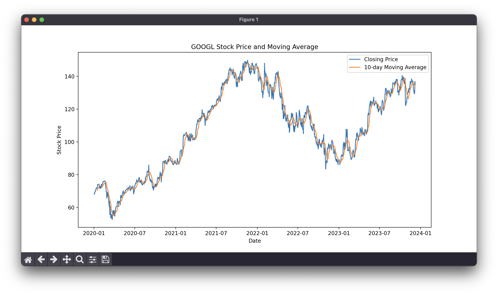
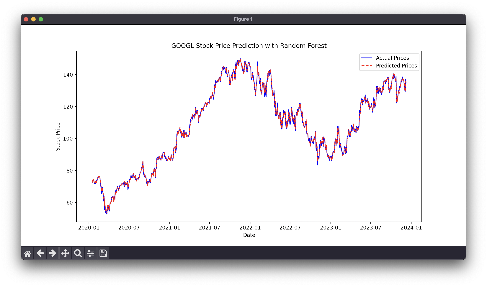

# Summary
Yahoo Finance에서 원하는 종목을 가져와 시각화하고 이를 Random Forest Model을 이용하여 학습 후 해당 종목의 종가를 예측 후 성능 평가

## Stock Price & Moving Average
-AAPL(애플)
  
-GOOGL(구글)
  

## Stock Price Prediction
-AAPL(애플)
  
-GOOGL(구글)
  

## 성능 측정
```python
# 성능 측정
mse = mean_squared_error(y, y_pred) #y : 실제 종가, y_pred : 예측 종가

print(f'Mean Squared Error: {mse}') #AAPL) Mean Squared Error: 0.8135291959313535, GOOGL) Mean Squared Error: 0.5624618902569566
```
